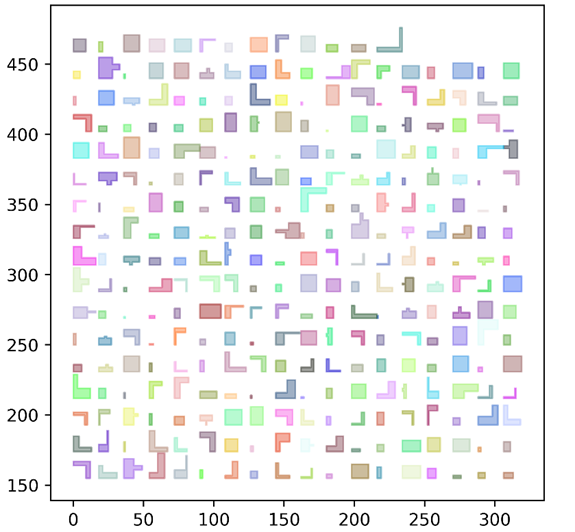
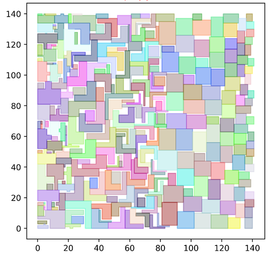
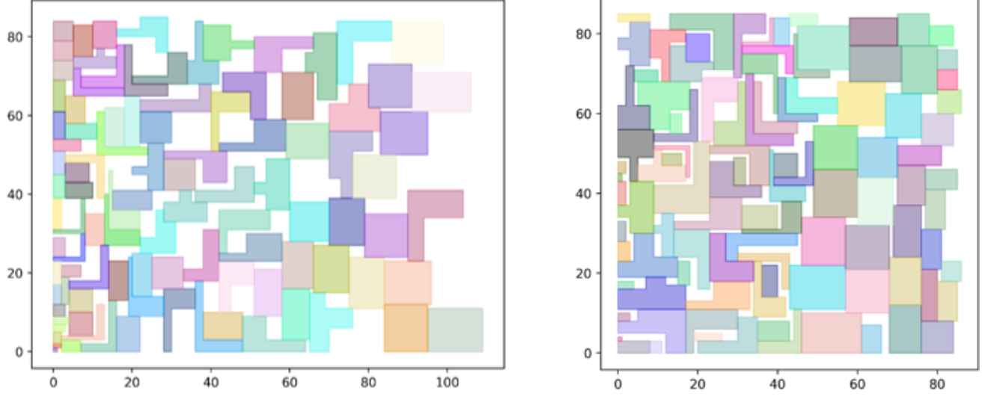

# Rectilinear Packing Problem Solver


Packing and layout problems are common in both engineering and non-engineering applications. In the Very Large Scale Integrated Circuit design, we often pack different IP Cores into a rectangular container. Usually, the IP Core is a rectilinear shape. To cut down the cost, we need to minimize the container. So the EDA software needs a fast and robust and high performance algorithm to solve the packing problem. Apart from EDA Software, many other industrial applications such as cloth cutting and newspaper layout are involved with this algorithm.

The term rectilinear means the interior angles of the packed blocks are either 90 degrees or 270 degrees. The container is usually a rectangle with a fixed width and unrestricted height. The algorithm will pack all the polygonal blocks into the container without overlapping, and generate a height as small as possible.


# Requirements


[mpi4py==3.0.3](https://pypi.org/project/mpi4py/) Before you install mpi4py, you need to install a mpi software such as OpenMpi or Microsoft MPI.

[pyclipper==1.2.0](https://pypi.org/project/pyclipper/)

[Polygon3==3.0.8](https://pypi.org/project/Polygon3/) When you install Polygon3, you must begin with a capital "P"

# How to run
```python main.py -d data_file.txt```

look at data/polygon_area_etc_input_id.txt for data format

# Result
This is an packing example. For our dataset, the average occupation rate is 85%.





# How this work

## NFP 
Outter NFP is used to avoid overlap between objects. Inner NFP is used to ensure the objects in the bin.


## Below left stratage
All Object is packed at the below left position.


## Complex and big first stratage



## Parallel computation
The computation of NFPs can be parallelized, we use MPI as the parallel computation tool. 

 

## More about this project
the "doc" folder contains [docx](doc/software_description.docx) and [pptx](doc/software_description.pptx) files, they described this software in detail.
